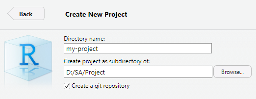
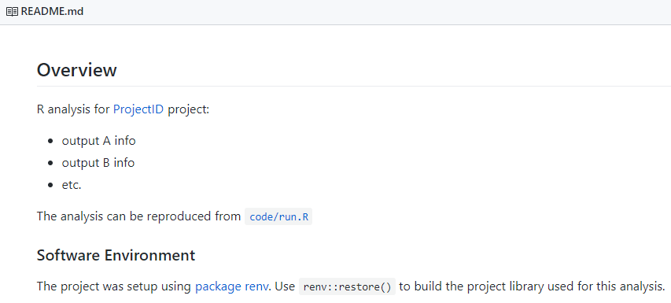
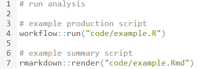
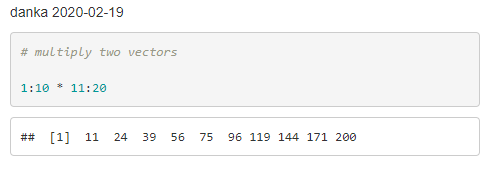
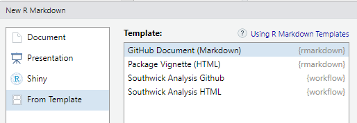

# Overview

The workflow package is intended to add consistency/efficiency to R-based analyses. These aren't rules, rather they're what I consider good defaults. My thinking was influenced by [Cookiecutter Data Science](https://drivendata.github.io/cookiecutter-data-science/). See [B4W-19-01](https://github.com/southwick-associates/B4W-19-01) for a moderately complex project that follows these guidelines.

## Steps

1. [Create a project with Rstudio](#create-project)
2. [Isolate from other projects with package renv](#define-your-software-environment)
3. [Make template files/folders with package workflow](#initialize-workflow)

### 1. Create Project

Make an [RStudio Project](https://r4ds.had.co.nz/workflow-projects.html) (in RStudio: File > New Project). I suggest checking "Create a git repository" in case you want to use version control (and it will also set you up for placing the project on Github). If you're new to Git, there is a [nice intro chapter](http://r-pkgs.had.co.nz/git.html) in Hadley Wickham's R packages book.




### 2. Isoloate Project Packages

Use [package renv](https://rstudio.github.io/renv/index.html) to isolate your project package libraries and help ensure the code can be run on another machine. Running `renv::init()` adds a few more files which renv will use (and you shouldn't edit by hand). The `renv.lock` file defines the project's package versions, which enables installation on another machine with `renv::restore()`.

```r
install.packages("renv")
renv::init() # initialize the project library
```

### 3. Create Template Files

You'll need to first install package workflow into the project package library. Note that after package installations, you should use `renv::snapshot()` to ensure an up-to-date record of the packages used in the project.

```r
install.packages("remotes")
remotes::install_github("southwick-associates/workflow")
renv::snapshot()
```

Create a template workflow with `workflow::init()`.

```r
workflow::init()

#> Template files/folders have been added to:
#> - D:/SA/Project/my-project

#> README.md       # project-level documentation
#> code/
#>   example.R
#>   example.Rmd
#>   run.R         # master script
#> data/
#>   README.md     # data documentation
#>   external/     # input data from public sources (e.g., Census)
#>   interim/      # intermediate data
#>   processed/    # final data
#>   raw/          # input data from internal sources (e.g., surveys)
#> out/            # output for deliverables (tables, figures, etc.)
```

### README.md

This file is the documentation for your project, and it will conveniently display on the landing page of a Github repo.



### code/run.R

A master script is a nice way to organize your code. I recommend using regular `.R` files for production code and ordering them sequentially (e.g., `01-load-raw.R`, `02-clean.R`, etc.). 



### code/log/example.md

Using `workflow::run("code/example.R")` sources the R script and produces a log summary that displays nicely on Github:



### Rmd Templates

I consider `.Rmd` files better-suited to summary reports. Note that this package includes a couple of templates which you can access in Rstudio using File > New File > R Markdown:


