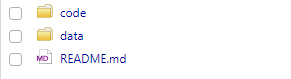

# Overview

The workflow package is intended to add consistency/efficiency to R-based analyses. I've provided workflow guidelines below, but these aren't hard-and-fast rules. My thinking on this process was heavily influenced by an approach from DrivenData: [Cookiecutter Data Science](https://drivendata.github.io/cookiecutter-data-science/). 

To set up a new project:

1. [Create a project with Rstudio](#create-project)
2. [Isolate from other projects with package renv](#define-your-software-environment)
3. [Make template files/folders with package workflow](#initialize-workflow)

## 1. Create Project

Make an [RStudio Project](https://r4ds.had.co.nz/workflow-projects.html). In RStudio: File > New Project. I suggest checking "Create a git repository" in case you want to use version control (and it will also set you up for placing the project on Github). If you're new to Git, there is a [nice intro chapter](http://r-pkgs.had.co.nz/git.html) in Hadley Wickham's R packages book.


### Project Files:


## 2. Isoloate Project Packages

Use [package renv](https://rstudio.github.io/renv/index.html) to isolate your project package libraries and help ensure the code can be run on another machine. Running `renv::init()` adds a few more files which renv will use (and you shouldn't edit by hand). The `renv.lock` file defines the project's package versions, which enables installation on another machine with `renv::restore()`.

```r
install.packages("renv")
renv::init() # initialize the project library
```

### New Files:


## 3. Initialize Workflow

Populate the project with template files/folders using `workflow::init()`:

```r
install.packages("remotes")
remotes::install_github("southwick-associates/workflow")
workflow::init()
renv::snapshot() # record project library changes after package installations
```

### New Files:



### README.md

This file is the documentation for your project, and it will conveniently display on the Github landing page (if you make a Github repo):


### data/README.md

It's also helpful to include documentation about the input data you use. I like organizing data into 4 subfolders:


### code/run.R

A master script is a nice way to organize your code. I recommend using regular `.R` files for production code and ordering them sequentially (e.g., `01-load-raw.R`, `02-clean.R`, etc.). 


### code/log/example.md

Using `workflow::run("code/example.R")` sources the R script and produces a log summary that displays nicely on Github:


### Rmd Templates

I consider `.Rmd` files better-suited to summary reports. Note that this package includes a couple of templates which you can access in Rstudio using File > New File > R Markdown:


